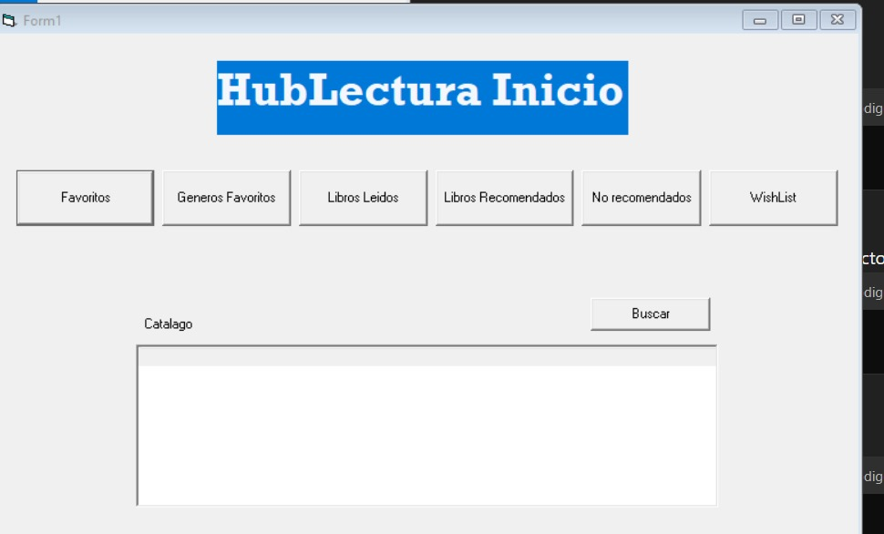
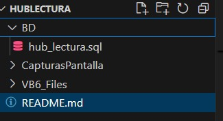

# HUBLectura

Este es un proyecto desarrollado con Visual Basic 6 como Hub de lectura para que los usuarios puedan tener el control de sus lecturas y libros facvoritos, integrando una Base de datos con MySQL que se anexa al proyecto. 
*Nombre del proyecto*: Hub de Lectura
*Nombre de desarrolladora:* Isabel F. Montes
*Usuaria en Discor*: isa_montes2507

---

## Descripción
En el sprint 5 se planteo la necesidad de un hub  de lectura donde los usuarios pudieran consultar el catalago de libros y poder tener de manera personalizada listas de clasificación de libros de acuerdo a sus preferencias para así poder tener un mejor control de sus lecturas diarias. 

## Requerimientos tecnicos

-Visual Basic(para abrir proyecto)
-Instalador de drivers para BD
-VS Code
-My SQL Serve

## Instalación

1. Clonar repositorio de git(para extraer los recuersos)
2. Establecer una carpeta 
3. Creación del proyecto
4. Exportar el proyecto con Visual Basic 6 
6. Incializar proyecto

---

## Capturas

Proceso de trabajo:

Diseño de la BD en un  digrama para poder implementarlo por medio de sql. 

En esta imagen, es al vista general que tiene los usuarios para poder acceder a sus listas favoritas y ver el catálago general.

La base de datos con los registros se encuentra en esta parte del proyecto, ya cuenta con varios usuarios agregados y registros de libros.

## Proceso

Por medio de la instalacion de visual basic 6 se creo un nuevo proyecto que se fue acomodando con la interfaz por medio de forms que tenian funcionalidades especificas en listas, esto se dio con los elementos que el entorno VB6 proporcionaba, asi como el codigo de los comportamientos que los botones esperaban ya que al ser programación orientada a eventos cada una de estas se podia dar una función en especifico

## Problemas presentados

- Trabajo con un programa muy antiguo y desconocimiento del mismo
- Falta de buen UX para el usuario
- Conexion directa entre BD y Visual

# Mi Proyecto Angular

## Retrospectiva del Proyecto

| ¿Qué salió bien? | ¿Qué puedo hacer diferente? | ¿Qué no salió bien? |
|------------------|-----------------------------|---------------------|
| Salio bien la instalación de los programas solicitados y el entendiemiento basico del entorno | Uso de mejores practicas de UX y conexion con  BD       | Que el diseño del HUB sea más agradable y funcional |
|                  |                             |                     |

